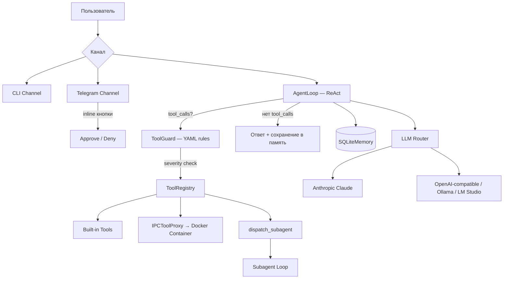

# CorpClaw Lite

Надёжный Python AI-агент для корпоративного закрытого контура — Telegram-бот, который выполняет рутинные задачи через скиллы/плагины/субагенты, работает с **локальными LLM** и управляет доступом по департаментам.

> **Статус: В разработке.** Ядро написано, тесты зелёные, но ряд компонентов требует ручной настройки перед первым запуском (Docker-образ, конфиги, env-переменные). Полноценный production-деплой пока не тестировался.

---

## Архитектура



### Ключевые принципы

- **Simple ReAct Loop** — без LLM-планировщиков, ~290 строк
- **Docker Sandbox** — per-user изолированный контейнер с bind-mount `/workspace`; жёсткий блок: агент не стартует без работающего Docker
- **IPCToolProxy** — файловые инструменты (`read_file`, `exec_script`, …) маршрутизируются в контейнер через HMAC-подписанный `docker exec`
- **XML Tool Calling Fallback** — автоматический парсинг `<tool_call>` XML из текста модели
- **Context Compression** — трёхуровневое сжатие для локальных LLM (паттерн Hermes)
- **Smart Approvals** — LLM-оценка риска или ручное подтверждение (режимы: `manual` / `smart` / `off`)
- **Parallel Tool Execution** — параллельное выполнение независимых инструментов
- **Субагенты** — изолированные исполнители со своим ToolRegistry и промптом
- **ToolGuard** — YAML-правила безопасности с уровнями CRITICAL/HIGH/MEDIUM/INFO
- **IPC Auth** — HMAC-SHA256 + nonce + replay protection

---

## Что работает сейчас

| Компонент | Статус |
|-----------|--------|
| AgentLoop (ReAct) | ✅ Готов, протестирован |
| LLM Router (Ollama / Anthropic / любой OpenAI-compatible) | ✅ Готов |
| XML Tool Calling Fallback | ✅ Готов |
| Builtin Tools (файлы, Excel, web, скрипты) | ✅ Готов |
| ToolGuard (YAML-правила) | ✅ Готов |
| SQLite Memory + консолидация | ✅ Готов |
| Context Compression | ✅ Готов |
| Telegram Channel (polling + inline Approve/Deny) | ✅ Готов |
| CLI Channel | ✅ Готов |
| Skill Hot-reload | ✅ Готов |
| MCP Client | ✅ Готов |
| Субагенты | ✅ Готов |
| Security (IPC HMAC, Network Policy, CredentialScrubber) | ✅ Готов |
| Container Manager + IPCToolProxy | ✅ Реализован, **образ нужно собрать** |
| Docker-образ (`corpclaw-agent-base`) | ⏳ Нужно собрать: `make build-agent` |
| Логирование (corpclaw.log + agent_activity.jsonl) | ✅ Готов |
| Health Endpoint (`/health`) | ⚙️ Опционально (нужен `uv add aiohttp`) |
| Departments / RBAC | ✅ Готов |
| Admin Notifier | ✅ Готов |

---

## Требования перед запуском

### 1. Обязательно

```bash
# Установка зависимостей
uv sync

# Скопировать и заполнить .env
cp .env.example .env
```

В `.env` обязательно задать:

| Переменная | Описание |
|-----------|---------|
| `TELEGRAM_BOT_TOKEN` | Токен бота от @BotFather |
| `CORPCLAW_IPC_SECRET` | Произвольная строка ≥32 символов (HMAC-ключ для IPC между host и контейнером) |
| `OPENAI_BASE_URL` | URL базового провайдера (напр. `http://localhost:11434/v1` для Ollama) |

Опционально:

| Переменная | Описание |
|-----------|---------|
| `ANTHROPIC_API_KEY` | Если нужен Claude |
| `OPENAI_API_KEY` | Если базовый провайдер требует авторизации (напр. OpenRouter) |

### 2. Docker-контейнер (sandbox)

По умолчанию контейнерная изоляция **включена** (`container.enabled: true` в `settings.yaml`).
Перед запуском нужно один раз собрать образ:

```bash
make build-agent
```

Чтобы запустить без Docker (режим разработки), установить в `config/settings.yaml`:
```yaml
container:
  enabled: false
```

> ⚠️ В режиме `enabled: false` файловые инструменты выполняются на хосте напрямую. **Не использовать в production.**

---

## Quick Start

```bash
# Интерактивный CLI чат (без Telegram, без Docker)
# Сначала в settings.yaml установить container.enabled: false
uv run corpclaw-lite chat

# Telegram-бот (требует Docker + .env)
uv run corpclaw-lite telegram
```

---

## Конфигурация

| Файл | Описание |
|------|----------|
| `config/settings.yaml` | LLM-провайдеры, роутинг, агент, контейнер, логирование |
| `config/departments.yaml` | RBAC: инструменты и бюджеты по департаментам |
| `config/tool_guard_rules.yaml` | Правила безопасности ToolGuard |
| `config/network_policy.yaml` | Network allowlist для контейнеров |
| `config/bootstrap/SOUL.md` | Персона и ценности агента |
| `config/bootstrap/COMPANY.md` | Корпоративный контекст |
| `.env` | Секреты и ключи (не коммитить) |

### LLM Router (`config/settings.yaml`)

Роутинг задач на конкретных провайдеров без изменения кода:

```yaml
llm:
  default: "default"
  named:
    default:
      type: "openai"
      model: "qwen2.5:7b"
      base_url: "${OPENAI_BASE_URL:-http://localhost:11434/v1}"
    cloud:
      type: "anthropic"
      model: "claude-3-5-sonnet-20241022"
      api_key: "${ANTHROPIC_API_KEY:-}"
  routing:
    - task_kind: "vision"
      provider: "vision"
    - task_kind: "consolidate"
      provider: "default"
```

---

## Built-in Tools

| Инструмент | Описание | Risk | Sandbox |
|-----------|----------|------|---------|
| `read_file` | Чтение файлов | LOW | ✅ В контейнере |
| `write_file` | Запись файлов | MEDIUM | ✅ В контейнере |
| `edit_file` | Редактирование файлов | MEDIUM | ✅ В контейнере |
| `list_files` | Листинг директорий | LOW | ✅ В контейнере |
| `search_files` | Поиск по содержимому | LOW | ✅ В контейнере |
| `normalize_excel` | Нормализация .xlsx | MEDIUM | ✅ В контейнере |
| `exec_script` | Shell execution | HIGH | ✅ В контейнере |
| `send_file` | Отправка файла пользователю | MEDIUM | — Host |
| `read_image` | Vision → текстовое описание | MEDIUM | — Host |
| `web_fetch` | HTTP запросы с SSRF-защитой | MEDIUM | — Host |
| `memory_store` / `memory_recall` | Долгосрочная память | LOW | — Host |
| `dispatch_subagent` | Делегирование субагенту | HIGH | — Host |

---

## Расширения

### Skills (`skills/*.md`)
Markdown-файлы с YAML frontmatter. Hot-reload без перезапуска.

### Plugins (`plugins/<name>/`)
Папки с `manifest.yaml` + optional `skill.md`, `tool.py`, `scripts/`.

### Subagents (`config/subagents/*.yaml`)
YAML-спецификации с изолированным набором инструментов и системным промптом.

### MCP
stdio-клиент для Model Context Protocol серверов, настраивается в `config/settings.yaml`.

---

## Логирование

После запуска логи пишутся в папку `logs/`:

| Файл | Содержимое |
|------|-----------|
| `logs/corpclaw.log` | DEBUG-трейс каждого запроса: LLM-ответы, вызовы инструментов, результаты |
| `logs/agent_activity.jsonl` | Структурированные JSON-записи (user_id, tools_used, duration_ms, status) |

Уровни настраиваются в `config/settings.yaml`:
```yaml
logging:
  level: "DEBUG"        # файловый лог
  console_level: "INFO" # консоль
  log_dir: "logs"
```

---

## CLI команды

```bash
uv run corpclaw-lite chat                       # Интерактивный CLI чат
uv run corpclaw-lite telegram                   # Запуск Telegram-бота
uv run corpclaw-lite user-list                  # Список пользователей
uv run corpclaw-lite user-create -t <tg_id> -d <dept>
uv run corpclaw-lite skill list                 # Скилы
uv run corpclaw-lite plugin list                # Плагины
uv run corpclaw-lite containers                 # Активные Docker-контейнеры
uv run corpclaw-lite prune                      # Удаление idle-контейнеров
uv run corpclaw-lite generate skill <name>      # Шаблон скила
uv run corpclaw-lite generate plugin <name>     # Шаблон плагина
uv run corpclaw-lite generate subagent <name>   # Шаблон субагента
```

---

## Тесты и качество

```bash
# Все тесты
uv run pytest tests/ -v

# С coverage (текущий baseline: ~79%)
uv run pytest tests/ --cov=src/corpclaw_lite --cov-report=term-missing

# Линтинг
uv run ruff check src/ --fix && uv run ruff format src/

# Типы (strict pyright)
uv run pyright src/

# Полный check — запускать перед коммитом
uv run ruff check src/ --fix && uv run ruff format src/ && uv run pyright src/ && uv run pytest tests/ -v
```

**Текущие метрики:** 404 тестов, 1 skipped, pyright strict 0 errors.

---

## Метрики проекта

| Компонент | LOC | Файлов |
|-----------|-----|--------|
| Agent Core | ~1300 | 8 |
| LLM Providers + Router | ~500 | 5 |
| Extensions (Tools, Skills, Plugins, MCP) | ~2000 | 24 |
| Security | ~450 | 4 |
| Channels (Telegram + CLI) | ~2100 | 12 |
| Container (Manager, IPC, Proxy, Policies) | ~600 | 5 |
| Memory | ~350 | 2 |
| Config + RBAC + Logging | ~500 | 8 |
| **Исходники** | **~9300** | **70** |
| **Тесты** | **~6900** | **56** |

---

## Чеклист перед production-запуском

- [ ] `make build-agent` — собрать Docker sandbox-образ
- [ ] `.env` заполнен (все обязательные переменные)
- [ ] `config/bootstrap/SOUL.md` и `COMPANY.md` написаны под вашу компанию
- [ ] `config/departments.yaml` настроен под ваши департаменты
- [ ] `CORPCLAW_IPC_SECRET` — уникальный секрет ≥32 символов
- [ ] `uv run pytest tests/ -v` — все тесты зелёные
- [ ] `uv run corpclaw-lite telegram` запускает бота и отвечает на сообщения
- [ ] Тест сценария: маркетолог отправляет Excel → бот возвращает нормализованный файл

---

## Лицензия

Проприетарный. Только для внутреннего использования.
