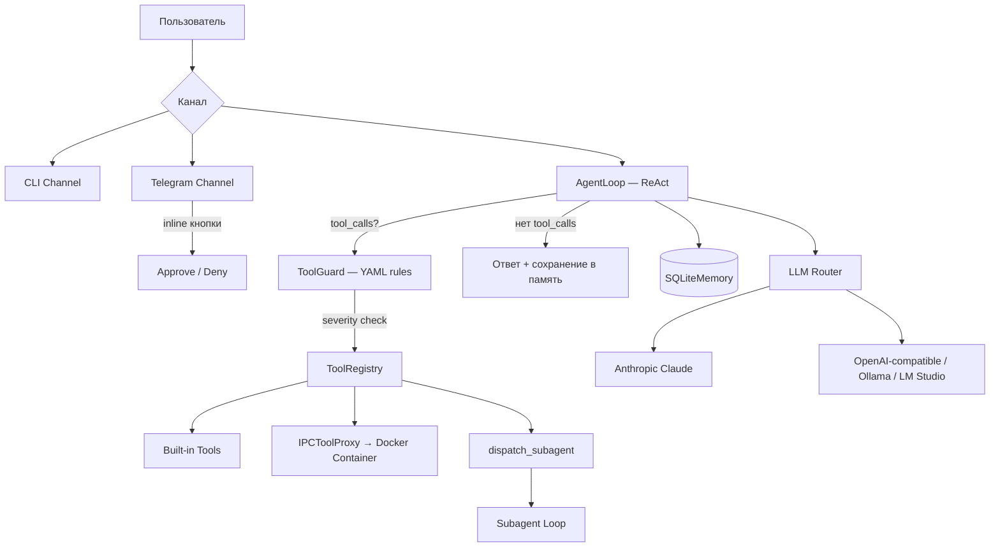
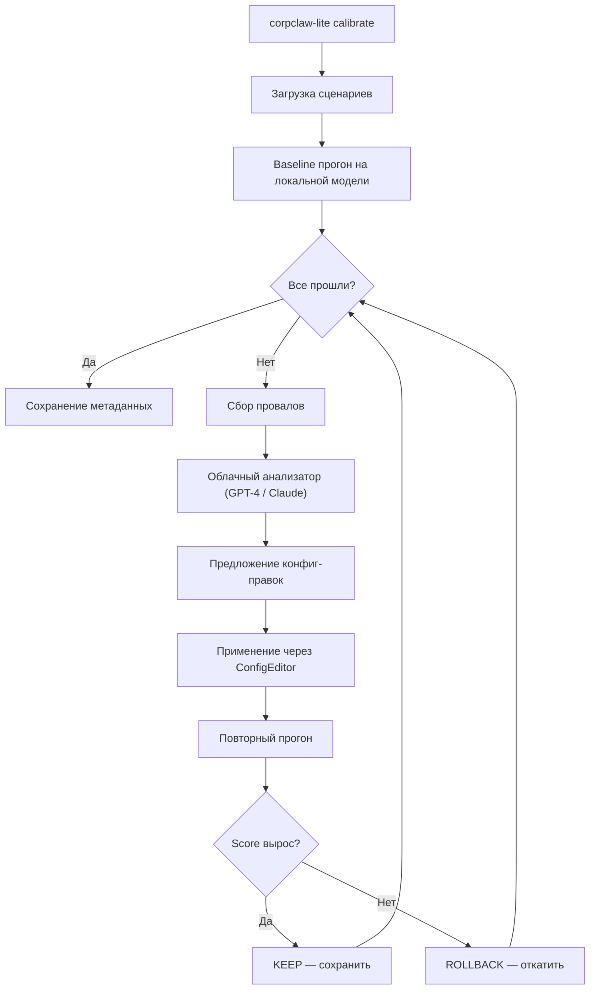
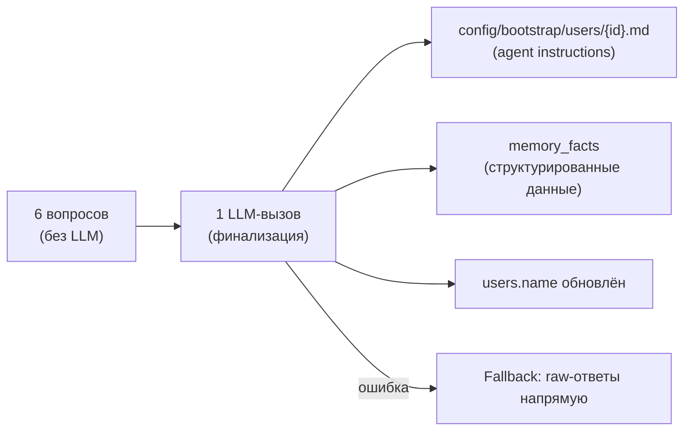

# CorpClaw Lite

Надёжный Python AI-агент для корпоративного закрытого контура — Telegram-бот, который выполняет рутинные задачи через скиллы/плагины/субагенты, работает с **локальными LLM** и управляет доступом по департаментам.

> **Статус: Готов к эксплуатации (Production-Ready).** Ядро стабилизировано, покрыто тестами (533 pass / 0 fail), решены все проблемы зависания процессов (Graceful Shutdown) и безопасной изоляции внутри Docker-контейнеров (Secure Sandbox).

---

## Архитектура



### Ключевые принципы

- **Simple ReAct Loop** — без LLM-планировщиков, ~290 строк
- **Docker Sandbox** — per-user изолированный контейнер с bind-mount `/workspace`; жёсткий блок: агент не стартует без работающего Docker
- **IPCToolProxy** — файловые инструменты (`read_file`, `exec_script`, …) маршрутизируются в контейнер через HMAC-подписанный `docker exec`
- **XML Tool Calling Fallback** — автоматический парсинг `<tool_call>` XML из текста модели
- **Context Compression** — трёхуровневое сжатие для локальных LLM (паттерн Hermes)
- **Smart Approvals** — LLM-оценка риска или ручное подтверждение (режимы: `manual` / `smart` / `off`)
- **Parallel Tool Execution** — параллельное выполнение независимых инструментов
- **Subagents** — изолированные исполнители со своим ToolRegistry и промптом
- **ToolGuard** — YAML-правила безопасности с уровнями CRITICAL/HIGH/MEDIUM/INFO
- **IPC Auth** — HMAC-SHA256 + nonce + replay protection
- **Graceful Shutdown** — централизованный перехват SIGINT/SIGTERM, гарантирующий остановку всех фоновых задач и Docker-контейнеров без зомби-процессов

---

## Что работает сейчас

| Компонент | Статус |
|-----------|--------|
| AgentLoop (ReAct) | ✅ Готов, протестирован |
| LLM Router (Ollama / Anthropic / любой OpenAI-compatible) | ✅ Готов |
| XML Tool Calling Fallback | ✅ Готов |
| Builtin Tools (файлы, Excel, web, скрипты) | ✅ Готов |
| ToolGuard (YAML-правила) | ✅ Готов |
| SQLite Memory + консолидация | ✅ Готов |
| Context Compression | ✅ Готов |
| Telegram Channel (polling + inline Approve/Deny) | ✅ Готов |
| CLI Channel | ✅ Готов |
| Skill Hot-reload | ✅ Готов |
| MCP Client | ✅ Готов |
| Субагенты | ✅ Готов |
| Security (IPC HMAC, Network Policy, CredentialScrubber) | ✅ Готов |
| Container Manager + IPCToolProxy | ✅ Реализован, **образ нужно собрать** |
| Docker-образ (`corpclaw-agent-base`) | ⏳ Нужно собрать: `make build-agent` |
| Логирование (corpclaw.log + agent_activity.jsonl) | ✅ Готов |
| Health Endpoint (`/health`) | ⚙️ Опционально (с безопасным fallback без aiohttp) |
| Departments / RBAC | ✅ Готов |
| Admin Notifier | ✅ Готов |
| Graceful Shutdown | ✅ Готов (без ghost-контейнеров) |
| **User Onboarding** | ✅ **Готов — гибридный детерминистический + LLM-финализация** |
| **Calibration Phase** | ✅ **Готов — автоматическая адаптация под локальную модель** |

---

## Требования перед запуском

### 1. Обязательно

```bash
# Установка зависимостей
uv sync

# Скопировать и заполнить .env
cp .env.example .env
```

В `.env` обязательно задать:

| Переменная | Описание |
|-----------|---------|
| `TELEGRAM_BOT_TOKEN` | Токен бота от @BotFather |
| `CORPCLAW_IPC_SECRET` | Произвольная строка ≥32 символов (HMAC-ключ для IPC между host и контейнером) |
| `OPENAI_BASE_URL` | URL базового провайдера (напр. `http://localhost:11434/v1` для Ollama) |

Опционально:

| Переменная | Описание |
|-----------|---------|
| `ANTHROPIC_API_KEY` | Если нужен Claude |
| `OPENAI_API_KEY` | Если базовый провайдер требует авторизации (напр. OpenRouter) |

### 2. Docker-контейнер (sandbox)

По умолчанию контейнерная изоляция **включена** (`container.enabled: true` в `settings.yaml`).
Перед запуском нужно один раз собрать образ:

```bash
make build-agent
```

Чтобы запустить без Docker (режим разработки), установить в `config/settings.yaml`:
```yaml
container:
  enabled: false
```

> ⚠️ В режиме `enabled: false` файловые инструменты выполняются на хосте напрямую. **Не использовать в production.**

---

## Quick Start

```bash
# Интерактивный CLI чат (симулирует реального пользователя из БД)
# Требует предварительного создания пользователя через user-create
uv run corpclaw-lite chat --telegram-id <tg_id>

# Запустить/перезапустить настройку общения (онбординг)
uv run corpclaw-lite chat --telegram-id <tg_id> --setup

# Telegram-бот (требует Docker + .env)
uv run corpclaw-lite telegram
```

---

## Конфигурация

| Файл | Описание |
|------|----------|
| `config/settings.yaml` | LLM-провайдеры, роутинг, агент, контейнер, логирование |
| `config/departments.yaml` | RBAC: инструменты и бюджеты по департаментам |
| `config/tool_guard_rules.yaml` | Правила безопасности ToolGuard |
| `config/network_policy.yaml` | Network allowlist для контейнеров |
| `config/bootstrap/SOUL.md` | Персона и ценности агента |
| `config/bootstrap/COMPANY.md` | Корпоративный контекст |
| `config/calibration_scenarios.yaml` | Сценарии автоматической калибровки (14 шт.) |
| `config/calibrated/` | Результат калибровки — генерируется автоматически (gitignored) |
| `.env` | Секреты и ключи (не коммитить) |

### LLM Router (`config/settings.yaml`)

Роутинг задач на конкретных провайдеров без изменения кода:

```yaml
llm:
  default: "default"
  named:
    default:
      type: "openai"
      model: "qwen2.5:7b"
      base_url: "${OPENAI_BASE_URL:-http://localhost:11434/v1}"
    cloud:
      type: "anthropic"
      model: "claude-3-5-sonnet-20241022"
      api_key: "${ANTHROPIC_API_KEY:-}"
  routing:
    - task_kind: "vision"
      provider: "vision"
    - task_kind: "consolidate"
      provider: "default"
```

---

## Built-in Tools

| Инструмент | Описание | Risk | Sandbox |
|-----------|----------|------|---------|
| `read_file` | Чтение файлов | LOW | ✅ В контейнере |
| `write_file` | Запись файлов | MEDIUM | ✅ В контейнере |
| `edit_file` | Редактирование файлов | MEDIUM | ✅ В контейнере |
| `list_files` | Листинг директорий | LOW | ✅ В контейнере |
| `search_files` | Поиск по содержимому | LOW | ✅ В контейнере |
| `normalize_excel` | Нормализация .xlsx | MEDIUM | ✅ В контейнере |
| `exec_script` | Shell execution | HIGH | ✅ В контейнере |
| `send_file` | Отправка файла пользователю | MEDIUM | — Host |
| `read_image` | Vision → текстовое описание | MEDIUM | — Host |
| `web_fetch` | HTTP запросы с SSRF-защитой | MEDIUM | — Host |
| `memory_store` / `memory_recall` | Долгосрочная память | LOW | — Host |
| `dispatch_subagent` | Делегирование субагенту | HIGH | — Host |

---

## Расширения

### Skills (`skills/*.md`)
Markdown-файлы с YAML frontmatter. Hot-reload без перезапуска.

### Plugins (`plugins/<name>/`)
Папки с `manifest.yaml` + optional `skill.md`, `tool.py`, `scripts/`.

### Subagents (`config/subagents/*.yaml`)
YAML-спецификации с изолированным набором инструментов и системным промптом.

### MCP
stdio-клиент для Model Context Protocol серверов, настраивается в `config/settings.yaml`.

---

## Калибровка (Calibration Phase)

Автоматическая адаптация конфигурации агента под конкретную локальную модель.
Облачная модель анализирует провалы малой модели на типовых сценариях и итеративно
правит промпты, описания инструментов и few-shot примеры — пока score не достигнет
максимума. После калибровки агент работает **полностью автономно на локальной модели**.

> Вдохновлено [AutoAgent](https://github.com/kevinrgu/autoagent) — но вместо правки
> Python-кода правятся исключительно YAML/Markdown конфигурации.

### Архитектура



### Что калибруется (Edit Surfaces)

| Поверхность | Файл | Описание |
|-------------|------|----------|
| System Prompt | `config/calibrated/bootstrap/*.md` | Переписанные SOUL.md, BEHAVIOR.md с явными директивами для малой модели |
| Tool Descriptions | `config/calibrated/tool_overrides.yaml` | Упрощённые описания инструментов и параметров |
| Few-shot Examples | `config/calibrated/few_shots.yaml` | Примеры «запрос → правильный tool_call» — самый мощный рычаг для малых моделей |
| Agent Settings | `config/calibrated/settings_override.yaml` | Числовые параметры (max_steps, max_history, compression) |
| Метаданные | `config/calibrated/metadata.yaml` | model_id, score, timestamp, iterations |

### Quick Start

```bash
# 1. Проверить baseline score без облака (dry-run)
uv run corpclaw-lite calibrate --dry-run

# 2. Полная калибровка через облачную модель
#    (требует настроенный cloud-провайдер в settings.yaml)
uv run corpclaw-lite calibrate --cloud-provider cloud --max-iterations 5

# 3. Сбросить предыдущую калибровку
uv run corpclaw-lite calibrate --reset --dry-run
```

### Настройка облачного провайдера

В `config/settings.yaml` добавьте named-провайдер для анализа:

```yaml
llm:
  named:
    cloud:
      type: "anthropic"        # или "openai" для GPT-4
      model: "claude-sonnet-4-20250514"
      api_key: "${ANTHROPIC_API_KEY}"
```

### Сценарии калибровки

Стандартный набор (`config/calibration_scenarios.yaml`) включает 14 сценариев в 4 категориях:

| Категория | Сценариев | Что проверяет |
|-----------|-----------|---------------|
| `tool_use` | 6 | Вызов правильного инструмента (read_file, list_files, write_file, search_files, exec_script, send_file) |
| `no_tool` | 3 | Ответ без инструментов (математика, приветствие, знание) |
| `multi_step` | 3 | Цепочки из 2-3 последовательных tool-вызовов |
| `error_recovery` | 2 | Корректная обработка ошибок и повтор |

Вы можете добавлять собственные сценарии в тот же YAML-файл.

### Структура результата

После калибровки в `config/calibrated/` появятся:

```
config/calibrated/
├── metadata.yaml            # model_id, score_pct, timestamp
├── bootstrap/
│   ├── SOUL.md              # Переписанный системный промпт
│   └── BEHAVIOR.md          # Адаптированные правила поведения
├── tool_overrides.yaml      # Упрощённые описания инструментов
├── few_shots.yaml           # Примеры для инъекции в контекст
└── settings_override.yaml   # Оптимизированные параметры агента
```

> ⚠️ Директория `config/calibrated/` добавлена в `.gitignore` — результаты калибровки
> привязаны к конкретной модели и машине.

### Как это работает изнутри

1. **`CalibrationRunner`** прогоняет каждый сценарий через реальный `AgentLoop` с `TrajectoryRecorder`, который записывает все tool_calls и результаты
2. **`CalibrationScorer`** сравнивает траекторию с ожиданиями: subsequence-матчинг инструментов, проверка контента ответа, валидация чтения файлов
3. **`CalibrationAnalyzer`** отправляет провалы + текущую конфигурацию облачной модели и получает JSON с предложенными правками
4. **`ConfigEditor`** атомарно применяет правки (с backup для rollback)
5. **`CalibrationLoop`** повторяет цикл до 5 итераций, сохраняя только улучшения

### Параметры CLI

| Параметр | По умолчанию | Описание |
|----------|-------------|----------|
| `--dry-run` | `false` | Только baseline-прогон, без облачного анализа |
| `--reset` | `false` | Очистить `config/calibrated/` перед стартом |
| `--max-iterations` | `5` | Максимум итераций hill-climbing |
| `--cloud-provider` | `cloud` | Имя named-провайдера для анализа |
| `--local-provider` | `default` | Имя named-провайдера локальной модели |
| `--scenarios` | `config/calibration_scenarios.yaml` | Путь к файлу сценариев |

---

## Онбординг пользователя

При первом обращении (или по команде `/setup` в Telegram / `--setup` в CLI) пользователь проходит короткую настройку из 6 вопросов:

1. **Как тебя называть?** (обязательный)
2. **Манера общения** — формально, неформально, коротко
3. **Язык общения** — русский, English, другой
4. **О себе** — роль, проекты
5. **Типичные задачи** — что чаще делать
6. **Дополнительно** — любые предпочтения

### Как это работает



- **Phase 1 (сбор)** — детерминистический flow, вопрос за вопросом, без LLM
- **Phase 2 (финализация)** — один LLM-вызов генерирует:
  - Per-user bootstrap `.md` — actionable инструкции для агента
  - Structured facts — key-value пары в `memory_facts`
  - Обновление `user.name` в БД
- **Fallback** — если LLM недоступна, raw-ответы сохраняются напрямую

### Где хранится

| Данные | Расположение |
|--------|--------------|
| Прогресс онбординга | `data/users.db` → таблица `onboarding_state` |
| Per-user промпт | `config/bootstrap/users/{telegram_id}.md` |
| Факты о пользователе | `data/memory.db` → таблица `memory_facts` |
| Имя пользователя | `data/users.db` → таблица `users` |

### Интеграция

- **Telegram:** автоматически при первом сообщении + `/setup` для перенастройки
- **CLI:** автоматически при первом `chat` + `--setup` для перенастройки
- **AgentLoop:** user facts инжектируются в system prompt при каждом вызове

---

## Логирование

После запуска логи пишутся в папку `logs/`:

| Файл | Содержимое |
|------|-----------|
| `logs/corpclaw.log` | DEBUG-трейс каждого запроса: LLM-ответы, вызовы инструментов, результаты |
| `logs/agent_activity.jsonl` | Структурированные JSON-записи (user_id, tools_used, duration_ms, status) |

Уровни настраиваются в `config/settings.yaml`:
```yaml
logging:
  level: "DEBUG"        # файловый лог
  console_level: "INFO" # консоль
  log_dir: "logs"
```

---

## CLI команды

```bash
uv run corpclaw-lite chat --telegram-id <tg_id>         # Интерактивный CLI чат
uv run corpclaw-lite chat --telegram-id <tg_id> --setup # Перенастроить общение
uv run corpclaw-lite telegram                           # Запуск Telegram-бота
uv run corpclaw-lite user-list                          # Список пользователей
uv run corpclaw-lite user-create -t <tg_id> -d <dept> -n <name>
uv run corpclaw-lite user-allow -t <tg_id> -d <dept>
uv run corpclaw-lite skill list                         # Скилы
uv run corpclaw-lite plugin list                        # Плагины
uv run corpclaw-lite containers                         # Активные Docker-контейнеры
uv run corpclaw-lite prune                              # Удаление idle-контейнеров
uv run corpclaw-lite generate skill <name>              # Шаблон скила
uv run corpclaw-lite generate plugin <name>             # Шаблон плагина
uv run corpclaw-lite generate subagent <name>           # Шаблон субагента
uv run corpclaw-lite calibrate                          # Калибровка под локальную модель
uv run corpclaw-lite calibrate --dry-run                # Только baseline score
```

---

## Тесты и качество

```bash
# Все тесты
uv run pytest tests/ -v

# С coverage (текущий baseline: ~79%)
uv run pytest tests/ --cov=src/corpclaw_lite --cov-report=term-missing

# Линтинг
uv run ruff check src/ --fix && uv run ruff format src/

# Типы (strict pyright)
uv run pyright src/

# Полный check — запускать перед коммитом
uv run ruff check src/ --fix && uv run ruff format src/ && uv run pyright src/ && uv run pytest tests/ -v
```

**Текущие метрики:** 533 теста (0 failed), pyright strict 0 errors, 100% ruff compliance.

---

## Метрики проекта

| Компонент | LOC | Файлов |
|-----------|-----|--------|
| Agent Core | ~1300 | 8 |
| LLM Providers + Router | ~500 | 5 |
| Extensions (Tools, Skills, Plugins, MCP) | ~2000 | 24 |
| Security | ~450 | 4 |
| Channels (Telegram + CLI) | ~2100 | 12 |
| Container (Manager, IPC, Proxy, Policies) | ~600 | 5 |
| Memory | ~350 | 2 |
| Config + RBAC + Logging | ~500 | 8 |
| **Onboarding** | **~550** | **5** |
| **Calibration** | **~900** | **8** |
| **Исходники** | **~10750** | **83** |
| **Тесты** | **~8500** | **59** |

---

## Чеклист перед production-запуском

- [x] `make build-agent` — собрать Docker sandbox-образ
- [x] `.env` заполнен (все обязательные переменные)
- [ ] `config/bootstrap/SOUL.md` и `COMPANY.md` написаны под вашу компанию
- [ ] `config/departments.yaml` настроен под ваши департаменты
- [x] `CORPCLAW_IPC_SECRET` — уникальный секрет ≥32 символов
- [x] `uv run pytest tests/ -v` — все тесты зелёные (533/533)
- [x] `uv run corpclaw-lite telegram` запускает бота и отвечает на сообщения
- [ ] Тест сценария: маркетолог отправляет Excel → бот возвращает нормализованный файл
- [ ] `uv run corpclaw-lite calibrate --dry-run` — baseline score для выбранной модели
- [ ] `uv run corpclaw-lite calibrate` — полная калибровка через облачную модель

---

## Лицензия

Проприетарный. Только для внутреннего использования.
