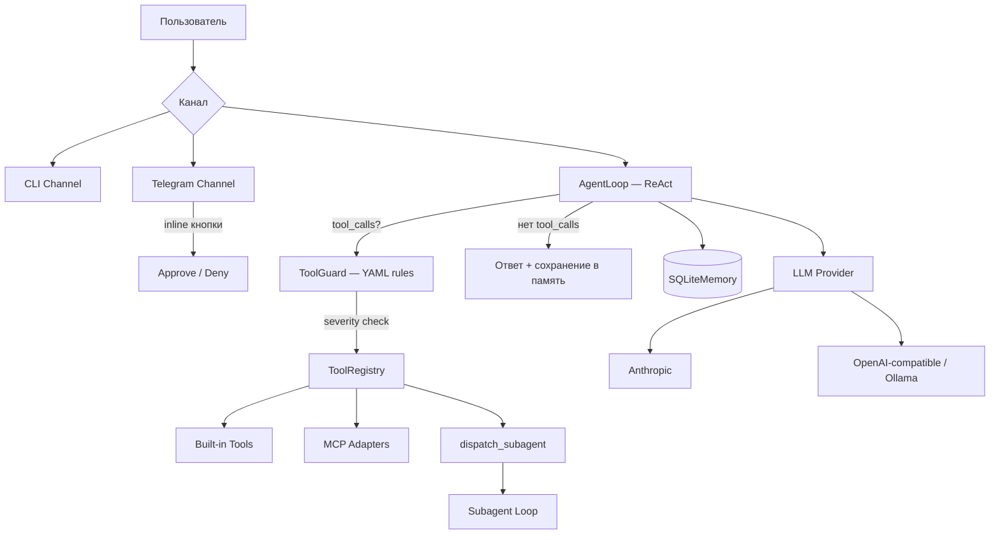

# CorpClaw Lite

Надёжный Python AI-агент для корпоративного закрытого контура — Telegram-бот, который выполняет рутинные задачи через скиллы/плагины/субагенты, работает с **локальными LLM** и управляет доступом по департаментам.

> **Статус:** Phase 5 (Polishing) — 67 модулей, ~8K LOC, 301 тест, pyright strict 0 errors.

## Quick Start

```bash
# Установка зависимостей
uv sync

# Интерактивный CLI чат
uv run corpclaw-lite chat

# Запуск Telegram-бота
export TELEGRAM_BOT_TOKEN="your-token"
export CORPCLAW_IPC_SECRET="your-secret"
uv run corpclaw-lite telegram
```

## Архитектура



### Ключевые принципы

- **Simple ReAct Loop** — без LLM-планировщиков, ~267 строк
- **Context Compression** — трёхуровневое сжатие контекста для локальных LLM (паттерн Hermes)
- **XML Tool Calling Fallback** — автоматический парсинг `<tool_call>` XML из текста, если модель не поддерживает native function calling
- **Smart Approvals** — LLM-оценка риска tool calls (режимы: `manual` / `smart` / `off`)
- **Parallel Tool Execution** — параллельное выполнение независимых инструментов через `asyncio.gather`
- **Субагенты** — изолированные исполнители со своим ToolRegistry
- **ToolGuard** — YAML-правила безопасности (CoPaw pattern)
- **Docker Sandbox** — seccomp + deny-by-default сеть (NemoClaw pattern)
- **IPC Auth** — HMAC-SHA256 + nonce + replay protection

## Built-in Tools

| Инструмент | Описание | Risk |
|-----------|----------|------|
| `read_file` | Чтение файлов | LOW |
| `write_file` | Запись файлов | MEDIUM |
| `edit_file` | Редактирование файлов | MEDIUM |
| `list_files` | Листинг директорий | LOW |
| `search_files` | Поиск по содержимому | LOW |
| `normalize_excel` | Нормализация .xlsx | MEDIUM |
| `web_fetch` | HTTP запросы с SSRF-защитой | MEDIUM |
| `exec_script` | Shell execution | HIGH |
| `send_file` | Отправка файла пользователю | MEDIUM |
| `read_image` | Vision → текстовое описание | MEDIUM |
| `memory_store` / `memory_recall` | Долгосрочная память | LOW |
| `dispatch_subagent` | Делегирование субагенту | HIGH |

## Конфигурация

| Файл | Описание |
|------|----------|
| `config/settings.yaml` | LLM-провайдер, модель, параметры |
| `config/departments.yaml` | RBAC: инструменты и бюджеты по департаментам |
| `config/tool_guard_rules.yaml` | Правила безопасности ToolGuard |
| `config/network_policy.yaml` | Network allowlist для контейнеров |
| `config/bootstrap/SOUL.md` | Персона и ценности агента |
| `config/bootstrap/COMPANY.md` | Корпоративный контекст |

## Расширения

### Skills (`skills/*.md`)
Markdown-файлы с YAML frontmatter. Hot-reload без перезапуска.

### Plugins (`plugins/<name>/`)
Папки с `manifest.yaml` + optional `skill.md`, `tool.py`, `scripts/`.

### Subagents (`config/subagents/*.yaml`)
YAML-спецификации с изолированным набором инструментов.

### MCP (`config/settings.yaml`)
stdio-клиент для Model Context Protocol серверов.

## CLI команды

```bash
uv run corpclaw-lite chat                       # Чат
uv run corpclaw-lite telegram                   # Telegram-бот
uv run corpclaw-lite user-list                  # Пользователи
uv run corpclaw-lite user-create -t <tg_id> -d <dept>
uv run corpclaw-lite skill list                 # Скилы
uv run corpclaw-lite plugin list                # Плагины
uv run corpclaw-lite containers                 # Docker-контейнеры
uv run corpclaw-lite prune                      # Удаление idle
uv run corpclaw-lite generate skill <name>      # Шаблон скила
uv run corpclaw-lite generate plugin <name>     # Шаблон плагина
uv run corpclaw-lite generate subagent <name>   # Шаблон субагента
```

## Тесты

```bash
uv run pytest tests/ -v                                        # Все тесты (301 тест)
uv run pytest tests/ --cov=src/corpclaw_lite --cov-report=term # Coverage
uv run ruff check src/ --fix && uv run ruff format src/        # Lint
uv run pyright src/                                            # Type check (strict)
```

## Метрики проекта

| Компонент | LOC | Файлов |
|-----------|-----|--------|
| Agent Core | 1136 | 7 |
| LLM Providers | 482 | 4 |
| Extensions | 1964 | 23 |
| Security | 446 | 4 |
| Channels | 2078 | 12 |
| Container | 426 | 4 |
| Memory | 350 | 2 |
| Config + RBAC | 548 | 6 |
| Logging | 136 | 3 |
| **Исходники** | **~7975** | **67** |
| **Тесты** | **~4895** | **43** |

## Лицензия

Проприетарный. Только для внутреннего использования.
