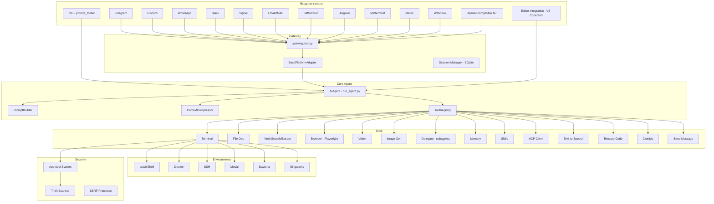

# Hermes Agent — Детальный анализ конкурента

> **Проект:** [NousResearch/hermes-agent](https://github.com/NousResearch/hermes-agent)  
> **Версия:** v0.4.0 (v2026.3.23)  
> **Язык:** Python (синхронный agent loop + async gateway)  
> **Размер:** ~50+ файлов, ~15K+ LOC ядра  
> **Лицензия:** Open Source (NousResearch)

---

## 1. Общая архитектура



---

## 2. Ключевые компоненты

### 2.1 Agent Loop (`run_agent.py` — класс `AIAgent`)

**Тип:** Синхронный ReAct loop (НЕ async)

**Цикл работы:**
```
User message → PromptBuilder (system prompt + context)
→ LLM API call → parse response
→ tool_calls? → execute tools (parallel if safe) → append results → repeat
→ no tool_calls? → return text response → save to session
```

**Ключевые особенности:**
- **Iteration budget** (`max_iterations`, default ~25) — жёсткий лимит на количество LLM-вызовов за один user message
- **Параллельное выполнение инструментов** — `_should_parallelize_tool_batch()` проверяет, безопасно ли выполнять батч tool_calls параллельно (path-aware для file mutations)
- **Length continuation** — при `finish_reason: length` автоматически продолжает генерацию
- **Auto-recovery** — при ошибках провайдера повторяет вызов без `tool_choice`
- **Streaming** — поддержка потоковой генерации для CLI и gateway

> [!IMPORTANT]
> Hermes использует **синхронный** agent loop (не async), что упрощает код, но ограничивает concurrency. Gateway обходит это через thread pool для каждой сессии.

### 2.2 Prompt Builder (`agent/prompt_builder.py`)

Собирает system prompt из компонентов:
1. **SOUL.md** — основная идентичность агента (заменяет hardcoded default)
2. **Platform hints** — информация об ОС, shell, пути
3. **Skills index** — краткое описание доступных навыков
4. **Context files** — `.hermes.md`, `CLAUDE.md`, `AGENTS.md` (priority-based selection)
5. **Memory snapshot** — «замороженная» версия `MEMORY.md` + `USER.md` для стабильности prompt cache
6. **Tool descriptions** — автоматически из registry

> [!TIP]
> **Prompt caching (Anthropic):** Hermes замораживает memory snapshot в system prompt, чтобы не инвалидировать Anthropic prompt cache при каждом обновлении памяти. Обновление происходит при смене сессии или при превышении порога изменений.

### 2.3 Context Compressor (`agent/context_compressor.py`)

**Многофазный алгоритм сжатия контекста (659 строк):**

| Фаза | Описание |
|------|----------|
| **1. Prune tool outputs** | Замена старых tool results на placeholder (без LLM, дешево) |
| **2. Head protection** | Сохранение system prompt + первого обмена |
| **3. Tail protection** | Token-budget (~20K tokens) для сохранения последнего контекста |
| **4. Structured summary** | LLM-суммаризация середины с шаблоном (Goal, Progress, Decisions, Files, Next Steps) |
| **5. Iterative update** | При повторном сжатии — обновление предыдущей суммы, а не создание новой |

**Дополнительные механизмы:**
- **`_sanitize_tool_pairs()`** — исправление orphaned tool_call/tool_result пар после сжатия
- **`_align_boundary_forward/backward()`** — корректировка границ сжатия, чтобы не разрезать группы tool_call+results
- **Configurable summary model** — можно использовать дешёвую модель для суммаризации

> [!WARNING]
> Это самая сложная часть Hermes. 659 строк только на compression, со множеством edge cases. Наш CorpClaw Lite пока не имеет аналогичного механизма, и это значительный gap.

### 2.4 Tool Registry (`tools/registry.py`)

**Паттерн:** Singleton registry с декоратор-based регистрацией

```python
@registry.register(
    name="terminal",
    description="Execute shell commands",
    parameters={...},
    toolset="terminal",
)
def handle_terminal(arguments, context):
    ...
```

**Каждый tool entry содержит:**
- `name`, `description`, `parameters` (JSON Schema)
- `handler` — функция-обработчик
- `toolset` — группа (для toolset management)
- `check_fn` — optional callable для проверки доступности
- `parallel_safe` / `reads_paths` / `writes_paths` — для параллельного выполнения

### 2.5 Toolsets (`toolsets.py`)

**Система группировки инструментов (576 строк):**

```python
TOOLSETS = {
    "web": {"tools": ["web_search", "web_extract"], "includes": []},
    "debugging": {"tools": ["terminal", "process"], "includes": ["web", "file"]},
    "hermes-cli": {"tools": _HERMES_CORE_TOOLS, "includes": []},
    "hermes-telegram": {"tools": _HERMES_CORE_TOOLS, "includes": []},
    ...
}
```

- Рекурсивное разрешение включений с cycle detection
- Runtime создание custom toolsets
- Plugin-registered toolsets (из tool registry)
- Все messaging платформы используют единый `_HERMES_CORE_TOOLS` список

---

## 3. Система безопасности

### 3.1 Approval System (`tools/approval.py`)

**Трёхуровневая система одобрения опасных команд (591 строк):**

| Уровень | Описание |
|---------|----------|
| **Pattern detection** | 20+ regex паттернов (rm -rf, chmod 777, fork bomb, pipe-to-sh, SQL DROP...) |
| **Session approval** | Per-session state (thread-safe, keyed by session_key) |
| **Permanent allowlist** | Сохраняется в config.yaml, загружается при старте |

**Три режима одобрения (`approvals.mode`):**
1. **`manual`** — всегда спрашивать пользователя (CLI prompt / gateway async)
2. **`smart`** — вспомогательная LLM оценивает риск (auto-approve low-risk, deny high-risk, escalate uncertain)
3. **`off`** — никогда не спрашивать

**Smart Approvals (по образцу OpenAI Codex):**
```python
def _smart_approve(command, description) -> str:
    # Вызов auxiliary LLM для оценки реального риска
    # Многие flagged команды — false positives
    # Returns: "approve", "deny", "escalate"
```

**Варианты ответа пользователя:**
- `[o]nce` — разрешить один раз
- `[s]ession` — разрешить на всю сессию
- `[a]lways` — добавить в permanent allowlist
- `[d]eny` — отклонить (с сообщением агенту "Do NOT retry")

### 3.2 Tirith Security Scanner (`tools/tirith_security.py`)

**Внешний бинарь с автоустановкой (675 строк):**

- Сканирует команды на content-level угрозы (homograph URLs, terminal injection, pipe-to-interpreter)
- **Exit code = verdict:** 0 = allow, 1 = block, 2 = warn
- **Auto-install** из GitHub Releases с SHA-256 + cosign provenance verification
- **Background installation** — не блокирует запуск
- **Fail-open / Fail-closed** — настраивается через config
- **24h failure marker** — предотвращает повторные попытки скачивания

### 3.3 Объединённый guard (`check_all_command_guards`)

```
Command → Tirith scan (content-level) + Pattern detection (structural)
→ block? → immediate block
→ warn? → check session/permanent approvals
→ not approved? → smart_approve (if mode=smart) or prompt user
→ approved → execute
```

> [!NOTE]
> **Сравнение с CorpClaw Lite:** Наш ToolGuard использует YAML-правила с severity levels (CRITICAL/HIGH/MEDIUM/INFO) и inline approve/deny. Hermes использует regex patterns + внешний binary scanner. Оба подхода имеют достоинства — наш более декларативен, Hermes более гранулярен на уровне content analysis.

---

## 4. Gateway и платформы

### 4.1 Platform Adapter Architecture

**Base class** (`gateway/platforms/base.py`, 1322 строки):

```python
class BasePlatformAdapter(ABC):
    async def connect() -> bool
    async def disconnect() -> None
    async def send(chat_id, content, reply_to, metadata) -> SendResult
    async def edit_message(chat_id, message_id, content) -> SendResult
    async def send_typing(chat_id) -> None
    async def send_image(chat_id, image_url, caption) -> SendResult
    async def send_voice(chat_id, audio_path) -> SendResult
    async def send_video(chat_id, video_path) -> SendResult
    async def send_document(chat_id, file_path) -> SendResult
    async def send_image_file(chat_id, image_path) -> SendResult
```

**Нормализованное представление сообщений:**
```python
@dataclass
class MessageEvent:
    text: str
    message_type: MessageType  # TEXT, PHOTO, VIDEO, AUDIO, VOICE, DOCUMENT...
    source: SessionSource
    media_urls: List[str]      # Локальные пути (после кэширования)
    reply_to_text: Optional[str]
```

### 4.2 Поддерживаемые платформы (14 адаптеров)

| Платформа | Файл | Размер | Особенности |
|-----------|------|--------|-------------|
| Telegram | telegram.py | 65KB | MarkdownV2, inline кнопки, group vision, thread-sessions |
| Discord | discord.py | 94KB | Persistent typing, DM vision, voice TTS, slash events |
| WhatsApp | whatsapp.py | 29KB | LID format, bridge child restart |
| Slack | slack.py | 32KB | Workspace integration |
| Signal | signal.py | 29KB | Attachments, group filtering, Note to Self protection |
| Matrix | matrix.py | 34KB | Vision support, image caching |
| Mattermost | mattermost.py | 25KB | @-mention filter, MIME types |
| DingTalk | dingtalk.py | 13KB | Chinese enterprise messenger |
| Email/IMAP | email.py | 20KB | IMAP reading + SMTP sending |
| SMS/Twilio | sms.py | 10KB | Twilio integration |
| Webhook | webhook.py | 21KB | External event triggers |
| Home Assistant | homeassistant.py | 16KB | Smart home events |
| API Server | api_server.py | 46KB | OpenAI-compatible `/v1/chat/completions` |
| ACP | (editor integration) | — | VS Code, Zed, JetBrains |

### 4.3 Медиа-кэширование

**Три кэша для медиа:**
- `image_cache/` — из-за эфемерных URL платформ (Telegram URLs expire ~1 hour)
- `audio_cache/` — voice messages для STT (Whisper)
- `document_cache/` — PDF, DOCX, XLSX для OCR

Каждый кэш: UUID-based имена, path traversal protection, auto-cleanup по возрасту.

---

## 5. Execution Environments

**6 бэкендов для выполнения команд:**

| Backend | Класс | Описание |
|---------|-------|----------|
| Local | `local.py` | Прямое выполнение через `subprocess` |
| Docker | `docker.py` | Изолированный контейнер |
| SSH | `ssh.py` | Удалённый сервер |
| Modal | `modal.py` | Modal.com serverless |
| Daytona | `daytona.py` | Daytona cloud workspace |
| Singularity | `singularity.py` | HPC Singularity container |

**Общий интерфейс:**
```python
class BaseEnvironment(ABC):
    def execute(command, cwd, timeout, stdin_data) -> {"output": str, "returncode": int}
    def cleanup() -> None
```

> [!TIP]
> **Для CorpClaw Lite:** Hermes разделяет "environment" (где выполнять) и "tool" (что вызывать). Наша архитектура container/ фокусируется только на Docker, но может быть расширена по паттерну Hermes для SSH и cloud backends.

---

## 6. Memory & Session System

### 6.1 Persistent Memory (`tools/memory_tool.py`)

**File-backed markdown memory:**
- **`MEMORY.md`** — факты об окружении (ОС, paths, preferences)
- **`USER.md`** — профиль пользователя

**Операции:**
- `add_memory(key, value)` — добавить запись
- `replace_memory(key, old_value, new_value)` — обновить
- `remove_memory(key)` — удалить

**Frozen snapshots:** для стабильности prompt cache — version pinning, обновление при смене сессии.

### 6.2 Session Storage (`hermes_state.py`)

**SQLite-backed с FTS5:**
- `sessions` table — метаданные (title, model, timestamps)
- `session_messages` table — history с `rowid` для FTS
- `session_messages_fts` — FTS5 index для полнотекстового поиска
- Thread-safe с `threading.Lock`

### 6.3 Honcho Memory (optional)

AI-native cross-session memory через Honcho service — альтернатива file-based memory для более сложного user modeling.

---

## 7. Skills System

### 7.1 Skills как Markdown-документы

- Скилы — `.md` файлы в `~/.hermes/skills/`
- Содержат инструкции, prerequisites, custom tools
- Index в system prompt (summary + prereqs)
- Hot-reload при изменении файлов

### 7.2 Skills Hub

- Каталог навыков с `hub.yaml`
- Install/uninstall через slash-команды
- Валидация метаданных перед установкой
- Agent-created skills с tirith scanning

### 7.3 Доступные навыки (примеры)

| Skill | Описание |
|-------|----------|
| OCR-and-documents | PDF/DOCX/XLS/PPTX OCR |
| Huggingface-hub | HF API integration |
| Sherlock OSINT | Username search |
| Meme-generation | Pillow-based meme creator |
| Bioinformatics | Index to 400+ bio skills |
| 3D-model-viewer | 3D visualization |
| FastMCP | MCP server creation |

---

## 8. Delegation (Sub-agents)

### Паттерн: `delegate_task` tool

```python
def delegate_task(task, context, tools=None, mode="single"):
    child = AIAgent(
        toolset=restricted_tools,
        conversation_history=[],  # Isolated context
        max_depth=parent.depth + 1,  # MAX_DEPTH = 2
    )
    result = child.run(task_with_context)
    return compact_result
```

**Ключевые характеристики:**
- **Изоляция контекста** — чистая history для каждого субагента
- **Ограниченный toolset** — можно указать подмножество инструментов
- **MAX_DEPTH = 2** — предотвращение рекурсивного бесконечного создания
- **Batch mode** — параллельная обработка нескольких задач
- **Thread safety** — parent's tool list сохраняется до создания child

> [!IMPORTANT]
> Hermes сохраняет parent's tool names перед созданием child agent, т.к. child construction мутирует глобальный registry. Это был реальный баг (#2083), исправленный в v0.4.0.

---

## 9. Провайдеры LLM

### Поддерживаемые провайдеры:
- **OpenAI** (включая o1, gpt-5.x серии)
- **Anthropic** (Claude 4.x, с prompt caching)
- **Google/Gemini**
- **Mistral**
- **GitHub Copilot** (OAuth + token validation)
- **Alibaba Cloud/DashScope**
- **Kilo Code**
- **OpenCode Zen/Go**
- **OpenRouter** (агрегатор)
- **Custom endpoints** (Ollama, vLLM, LM Studio через OpenAI-compatible API)

### Механизмы:
- **Eager fallback** на backup model при rate-limit
- **Context length detection** — models.dev integration, `/v1/props` для llama.cpp, fuzzy matching
- **Auxiliary client** — дешёвая/быстрая модель для служебных задач (compression, smart approvals)

---

## 10. Сравнение с CorpClaw Lite

| Аспект | Hermes Agent | CorpClaw Lite |
|--------|-------------|---------------|
| **Agent loop** | Синхронный ReAct | Async ReAct |
| **Язык** | Python (sync + async gateway) | Python (async-first) |
| **LLM провайдеры** | 10+ (все cloud) | Local-first (Ollama/vLLM) + cloud |
| **Каналы** | 14 платформ | CLI + Telegram |
| **Безопасность** | Pattern regex + Tirith binary + Smart Approvals | ToolGuard YAML + NetworkPolicy + IPC Auth |
| **Department ACL** | Нет | Встроен в ядро |
| **Контейнеры** | 6 backends | Docker-only |
| **Memory** | File-based `.md` | SQLite + vector |
| **Context compression** | 659 строк, structured | Не реализовано (gap!) |
| **Skills** | `.md` + hub + hot-reload | `.md` + manifest + hot-reload |
| **Sub-agents** | `delegate_task` tool | `subagent` с изоляцией |
| **Toolsets** | Dict-based + plugin toolsets | Manifest-based extensions |
| **MCP** | Встроен + OAuth 2.1 | Планируется |
| **Type checking** | Нет (no pyright/mypy) | pyright strict |
| **Testing** | Минимальные | pytest + coverage |

---

## 11. Что можно заимствовать для CorpClaw Lite

### 🟢 Высокий приоритет

1. **Context Compression** — структурированная суммаризация с iterative updates. У нас нет аналога, это критический gap для длинных сессий с локальными LLM.

2. **Smart Approvals** — LLM-based оценка реального риска команд. Снижает friction для пользователя, уменьшая false positives pattern matching.

3. **Tool output pruning** — дешёвая pre-pass замена старых tool results на placeholder перед LLM-суммаризацией. Можно внедрить независимо от полного compression pipeline.

4. **Frozen memory snapshots** — version pinning для стабильности prompt cache. Важно для Anthropic integration.

### 🟡 Средний приоритет

5. **Parallel tool execution** — path-aware batching для безопасного параллельного выполнения. Ускоряет работу при множественных file operations.

6. **Media caching для gateway** — UUID-based кэш для image/audio/document с path traversal protection и auto-cleanup. Наш Telegram канал может использовать этот паттерн.

7. **`_sanitize_tool_pairs()`** — исправление orphaned tool_call/result пар. Критично для робастности при сжатии контекста.

8. **Background memory/skill review** — замена inline nudges на фоновую проверку. Уменьшает шум в основном контексте.

### 🔴 Низкий приоритет / Не применимо

9. **14 messaging adapters** — мы фокусируемся на Telegram + CLI. Multi-platform gateway не в скоупе Sprint B/C.

10. **Skills Hub** — централизованный каталог навыков. У нас навыки — это markdown в `skills/`, без marketplace.

11. **Honcho Memory** — external AI memory service. Не совместим с нашим фокусом на closed-loop deployment.

---

## 12. Архитектурные уроки

### ✅ Hermes делает правильно:
- **Единый tool registry** с декораторами — чистый паттерн
- **Toolsets для группировки** — легко добавлять новые платформы
- **BasePlatformAdapter** с rich interface — хорошая абстракция для каналов
- **Media extraction** из ответов агента (markdown images, `MEDIA:` tags, local file paths)
- **Combined security check** — один вызов `check_all_command_guards()` вместо цепочки

### ⚠️ Hermes делает спорно:
- **Sync agent loop** — простой, но ограничивает concurrency. Наш async подход лучше для container-based execution.
- **No type checking** — нет pyright/mypy в CI. У нас strict pyright — значительное преимущество в maintainability.
- **Global mutable registry** — tool registry мутируется при создании subagents. Источник реальных багов (#2083).
- **File-based memory** — `MEMORY.md` с file locking менее надёжен, чем SQLite.
- **`sys.path.insert` hacks** — в `base.py` платформ. Признак неоптимальной структуры пакета.

### ❌ Hermes делает неправильно (для нашего контекста):
- **Нет department ACL** — все пользователи равны. Не подходит для корпоративного use case.
- **Нет IPC auth** — нет HMAC/nonce для container IPC. Безопасность на уровне "доверяем всем контейнерам".
- **Нет network policy** — Docker контейнеры не имеют deny-by-default network. У нас NemoClaw-inspired NetworkPolicy.

---

## 13. Статистика кодовой базы

| Компонент | Файлы | ~LOC |
|-----------|-------|------|
| Agent core (run_agent.py) | 1 | ~800 |
| Context compression | 1 | ~660 |
| Prompt builder | 1 | ~600 |
| Tool registry | 1 | ~240 |
| Toolsets | 1 | ~576 |
| Approval system | 1 | ~591 |
| Tirith security | 1 | ~675 |
| Session/state (SQLite) | 1 | ~800 |
| Memory tool | 1 | ~548 |
| Skills tool | 1 | ~800 |
| Delegate tool | 1 | ~790 |
| Platform base | 1 | ~1322 |
| Platform adapters | 13 | ~5000+ |
| Environments | 7 | ~1000+ |
| **Итого оценочно** | **~50+** | **~15K+** |

---

## 14. Резюме

**Hermes Agent** — зрелый, feature-rich AI-агент с самым широким среди конкурентов набором messaging-платформ (14 адаптеров). Его сильные стороны — продуманная система сжатия контекста, грануляризованная безопасность команд, и богатая экосистема навыков.

Для **CorpClaw Lite** наиболее ценными заимствованиями будут:
1. **Context Compression pipeline** — критический gap в нашей архитектуре
2. **Smart Approvals** — дополнение к нашему ToolGuard
3. **Tool output pruning** — быстрый win для оптимизации контекста

Наши конкурентные преимущества перед Hermes:
- **Department ACL** — корпоративный access control
- **Local LLM focus** — оптимизация для Ollama/vLLM
- **Security-first** — IPC Auth, NetworkPolicy, ToolGuard YAML
- **Type safety** — pyright strict mode
- **Async-first** — лучшая масштабируемость
