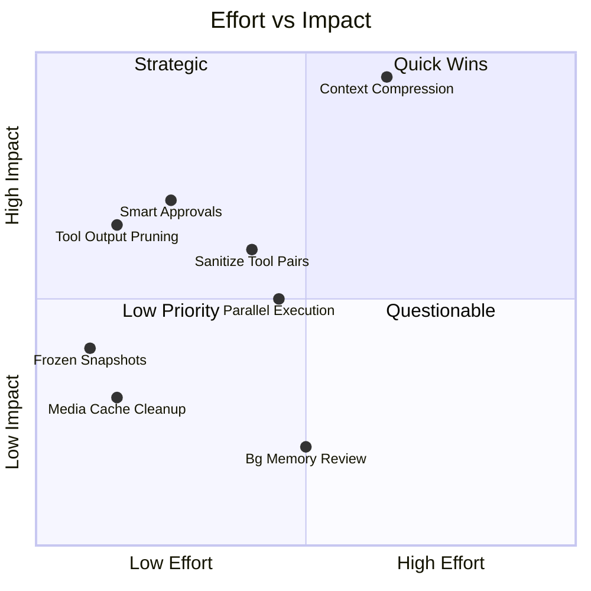

# Интеграция решений Hermes Agent в CorpClaw Lite

**Дата:** 24 марта 2026
**Обновлено:** 10 апреля 2026
**Основа:** [`hermes-agent-analysis.md`](./hermes-agent-analysis.md)
**Порядок:** Приоритет → Сложность → Точки интеграции → Конкретный план

## Статус реализации

| # | Фича | Статус | Файлы реализации |
|---|-------|--------|-----------------|
| 1 | Context Compression | ✅ Реализовано | `agent/compressor.py` (276 строк), `config/settings.py` (`CompressionSettings`) |
| 2 | Smart Approvals | ✅ Реализовано | `security/tool_guard.py` (263 строки), `config/settings.py` (`approval_mode`) |
| 3 | Tool Output Pruning | ✅ Реализовано | Встроено в `agent/compressor.py` (уровень 1) |
| 4 | Frozen Memory Snapshots | 🟡 Частично | History загружается один раз; полное Anthropic caching отложено |
| 5 | Parallel Tool Execution | ✅ Реализовано | `agent/loop.py` (`asyncio.gather`), `extensions/tools/base.py` (`parallel_safe`) |
| 6 | Media Caching | ❌ Не реализовано | — |
| 7 | Sanitize Tool Pairs | ✅ Реализовано | Встроено в `agent/compressor.py` (уровень 2) |
| 8 | Background Review | ❌ Не реализовано | — |

---

## Текущее состояние CorpClaw Lite

Для контекста — что у нас уже реализовано и где точки интеграции:

| Компонент | Файл | LOC | Статус |
|-----------|------|-----|--------|
| Agent Loop | `agent/loop.py` | 199 | ✅ ReAct loop, budget/progress guards |
| Context Builder | `agent/context.py` | 91 | ✅ Базовый (system + history + user msg) |
| Memory | `memory/sqlite.py` | 229 | ✅ SQLite (history + facts) |
| Consolidation | `memory/consolidation.py` | 85 | ✅ Базовая LLM-суммаризация |
| Tool Guard | `security/tool_guard.py` | 134 | ✅ YAML rules, severity, approval |
| Tool Registry | `extensions/tools/registry.py` | 91 | ✅ Простой dict-based |
| LLM Provider | `llm/base.py` | 66 | ✅ Protocol + response models |
| Channel base | `channels/base.py` | 33 | ✅ Protocol |
| Telegram channel | `channels/telegram/` | ~76KB | ✅ Full implementation |

---

## 🟢 Высокий приоритет

### 1. Context Compression

#### Зачем
Наш текущий `MemoryConsolidator` работает **между сессиями** (сжимает SQLite-историю). Но у нас **нет механизма сжатия контекста внутри одной сессии** — `context.messages` растёт неограниченно до тех пор, пока не достигнет лимита LLM. Для локальных LLM (8K-32K контекст) это критично: 5-7 tool_call циклов с длинными file outputs могут исчерпать контекстное окно.

#### Что есть у Hermes
Класс `ContextCompressor` (659 строк) с многофазным pipeline:
1. Tool output pruning (cheap, no LLM)
2. Head protection (system prompt + first exchange)
3. Tail protection by token budget (~20K)
4. Structured LLM summary (Goal, Progress, Decisions, Files, Next Steps)
5. Iterative summary update (при повторном сжатии)
6. `_sanitize_tool_pairs()` — orphaned tool_call/result cleanup

#### Точки интеграции в нашем коде

```
agent/loop.py (AgentLoop.run)
├── В КАЖДОЙ итерации while True:
│   ├── [NEW] context_compressor.should_compress(context.messages) ?
│   │   └── context.messages = context_compressor.compress(context.messages)
│   ├── budget.check()
│   ├── provider.chat(messages=context.messages, ...)
│   └── ... tool execution ...
```

#### Адаптация к нашей архитектуре

| Hermes | CorpClaw Lite | Адаптация |
|--------|--------------|-----------|
| Синхронный `compress()` | Наш loop async | `async def compress()` — суммаризация через `self._provider.chat()` |
| OpenAI SDK напрямую | `Provider` protocol | Использовать наш `Provider.chat()` для суммаризации |
| Rough token estimate (`len/4`) | Нет token counting | Можно использовать тот же rough estimate |
| `threshold_percent = 0.50` | Конфигурируемый | Через `AgentSettings` |
| `_previous_summary` state | Stateless loop | Хранить в `ContextCompressor` instance (per-run) |

#### Конкретный план

**Новые файлы:**
- `agent/compressor.py` — ~250-300 строк (адаптация ключевых механизмов)

**Изменения в существующих:**
- `agent/context.py` — добавить `estimate_tokens()`, `message_count` property
- `agent/loop.py` — вставить вызов compressor в main loop (5-10 строк)
- `config/settings.py` — добавить `CompressionSettings` в `AgentSettings`

**Что берём из Hermes:**
- ✅ Многофазный pipeline (prune → protect → summarize)
- ✅ Structured summary template (Goal/Progress/Decisions)
- ✅ Iterative summary update
- ✅ `_sanitize_tool_pairs()` — orphan cleanup
- ✅ Token-budget tail protection

**Что НЕ берём:**
- ❌ `_align_boundary_forward/backward()` — сложная логика для edge cases, добавим при необходимости
- ❌ Configurable summary model — у нас один provider, не нужен auxiliary client
- ❌ Prompt caching integration — не используем Anthropic для суммаризации

**Оценка:** ~250-300 строк нового кода, ~20 строк изменений  
**Сложность:** Средняя (чистая логика, без внешних зависимостей)  
**Риск:** Низкий (можно включить/выключить через конфиг)

**Конфигурация:**
```yaml
# settings.yaml
agent:
  compression:
    enabled: true
    threshold_ratio: 0.5          # Порог: сжимать при >50% context length
    max_context_tokens: 8000      # Оценка размера контекста модели
    protect_tail_tokens: 3000     # Сколько токенов хвоста защищать
    summary_ratio: 0.20           # Доля контента для summary
```

---

### 2. Smart Approvals

#### Зачем
Наш `ToolGuard` уже реализован (YAML rules, severity, ApprovalRequest). Но YAML patterns дают **false positives**: `python -c "print('hello')"` сматчится с паттерном `script execution via -c flag`, хотя полностью безопасна. Smart Approvals добавляют LLM-оценку, чтобы снизить friction.

#### Что есть у Hermes
Функция `_smart_approve()` (~50 строк):
- Вызов auxiliary LLM с промптом оценки реального риска
- Returns: `approve` | `deny` | `escalate`
- `escalate` → fallback на ручное одобрение

#### Точки интеграции

```
security/tool_guard.py (ToolGuard.check)
├── matches = [r for r in self._rules if r.evaluate(...)]
├── hard_blocks → ToolGuardError (CRITICAL/HIGH без approval)
├── approval_rules → [NEW] smart_evaluate() ?
│   ├── LLM verdict = approve → пропускаем
│   ├── LLM verdict = deny → ToolGuardError
│   └── LLM verdict = escalate → ApprovalRequest (как сейчас)
└── MEDIUM/INFO → log only
```

#### Адаптация

| Hermes | CorpClaw Lite | Адаптация |
|--------|--------------|-----------|
| `get_text_auxiliary_client()` | `Provider` protocol | Передавать provider в ToolGuard |
| Sync LLM call | Async | `async def smart_evaluate()` |
| Отдельный aux model | Наш routing | Через `ProviderRouter` с `task_kind: "approval"` |
| Config `approvals.mode: smart` | Settings | Через `AgentSettings` |

#### Конкретный план

**Изменения:**
- `security/tool_guard.py` — добавить `async def _smart_evaluate()` (~40 строк), модифицировать `check()` → `async def check()` (~15 строк)
- `agent/loop.py` — `self._tool_guard.check()` → `await self._tool_guard.check()` (1 строка)
- `config/settings.py` — добавить `approval_mode: str = "manual"` в `AgentSettings`

**Что берём:**
- ✅ LLM-based оценка риска как промежуточный шаг
- ✅ Три варианта: approve → пропускаем, deny → блокируем, escalate → ручной approval
- ✅ Контекстный промпт с командой и описанием правила

**Что НЕ берём:**
- ❌ Permanent allowlist persistence — у нас sessions stateless
- ❌ Session-scoped approval state — усложняет, не нужно для MVP

> [!WARNING]
> **Breaking change:** `ToolGuard.check()` сейчас синхронный (`def check()`). Для Smart Approvals его нужно сделать async (`async def check()`). Все вызывающие стороны (loop.py) должны добавить `await`. Изменение trivial, но нужно учитывать.

**Оценка:** ~60 строк нового кода, ~5 строк изменений  
**Сложность:** Низкая  
**Риск:** Низкий (за feature flag `approval_mode`)

---

### 3. Tool Output Pruning

#### Зачем
Самый дешёвый win из Hermes. Старые tool results (>200 символов) заменяются на `[Old tool output cleared to save context space]` **без LLM-вызова**. Это может освободить 30-50% контекста при работе с файлами (read_file возвращает сотни строк).

#### Точки интеграции
Это **часть Context Compression**, но может быть внедрена **независимо** как standalone pre-pass.

```
agent/context.py (ContextBuilder)
├── [NEW] prune_old_tool_results(protect_tail_count: int) → int
│   └── Итерация по self.messages, замена старых role="tool" > 200 chars
```

Или как standalone вызов в `loop.py` **перед** provider.chat():

```python
# agent/loop.py, в while True:
if len(context.messages) > 10:  # Не трогать маленькие контексты
    context.prune_old_tool_results(protect_tail=6)
```

#### Конкретный план

**Изменения:**
- `agent/context.py` — добавить метод `prune_old_tool_results()` (~25 строк)
- `agent/loop.py` — вызов перед `provider.chat()` (3 строки)

**Что берём:**
- ✅ Замена старых tool results (>200 chars) на placeholder
- ✅ Protection tail — не трогаем последние N tool results
- ✅ Подсчёт pruned для логирования

**Оценка:** ~30 строк нового кода  
**Сложность:** Очень низкая  
**Риск:** Минимальный (можно отключить конфигом)

---

### 4. Frozen Memory Snapshots

#### Зачем
Наш `ContextBuilder.build_initial()` загружает историю из SQLite при каждом вызове. Если мы когда-нибудь будем использовать Anthropic prompt caching, система промптов **не должна меняться** между tool_call итерациями, иначе кэш инвалидируется.

#### Точки интеграции

```
agent/loop.py (AgentLoop.run)
├── [ИЗМЕНЕНИЕ] history = self._memory.get_history(...) — вызывается ОДИН раз
├── context = ContextBuilder.build_initial(user, message, history=history)
├── while True:
│   ├── provider.chat(messages=context.messages)
│   └── ... (history уже "заморожена" в context.messages)
```

#### Текущее состояние

**Хорошая новость:** В нашем текущем коде history **уже загружается один раз** перед циклом (строка 69 `loop.py`). Это по сути уже frozen snapshot. System prompt тоже строится один раз.

**Что нужно для полноценной поддержки Anthropic cache:**
- Не инвалидировать system prompt при каждом tool call
- Использовать `cache_control` breakpoints в Anthropic API

#### Конкретный план

Сейчас уже работает в базовом виде. Полноценная реализация потребуется при добавлении Anthropic prompt caching:

1. `llm/anthropic.py` — добавить `cache_control: {"type": "ephemeral"}` к system message
2. `agent/context.py` — гарантировать immutability system prompt (уже есть)
3. `memory/sqlite.py` — добавить `get_snapshot_version()` для отслеживания изменений

**Оценка:** ~15 строк при текущей интеграции, ~50 строк при Anthropic caching  
**Сложность:** Низкая  
**Риск:** Нулевой (уже частично реализовано)  
**Статус:** 🟡 Частично реализовано, полная реализация отложена до Anthropic caching

---

## 🟡 Средний приоритет

### 5. Parallel Tool Execution

#### Зачем
Когда LLM возвращает несколько tool_calls за раз (например, `read_file` для 3 файлов), мы выполняем их **последовательно**. Параллельное выполнение ускоряет работу в 2-3x при I/O-bound операциях.

#### Что есть у Hermes
- `_should_parallelize_tool_batch()` — проверяет, можно ли выполнять batch параллельно
- Path-aware: если два tool_call пишут в один файл — sequential
- Safe tools (read_file, web_search) — всегда параллельны
- Unsafe tools (write_file, exec_script) — sequential

#### Точки интеграции

```
agent/loop.py (AgentLoop.run)
├── for tc in response.tool_calls:  ← ТЕКУЩИЙ (последовательный)
│   ├── check permissions
│   ├── check tool_guard
│   └── await registry.execute(tc.name, tc.arguments)
│
├── [NEW] parallel execution:
│   ├── if _can_parallelize(response.tool_calls):
│   │   └── await asyncio.gather(*[execute(tc) for tc in ...])
│   └── else:
│       └── for tc in response.tool_calls: ... (как сейчас)
```

#### Конкретный план

**Изменения:**
- `extensions/tools/base.py` — добавить `parallel_safe: bool = True` в `Tool` (1 строка)
- `agent/loop.py` — добавить `_can_parallelize()` (~20 строк) + `asyncio.gather` вариант (~25 строк)

**Что берём:**
- ✅ Базовая эвристика: read-only tools → parallel
- ✅ Path conflict detection для file tools

**Что НЕ берём:**
- ❌ `reads_paths` / `writes_paths` per-tool metadata — перекомплицировано для наших 8 tools

**Оценка:** ~50 строк изменений  
**Сложность:** Средняя (edge cases с error handling, progress guard)  
**Риск:** Средний (параллельное выполнение tools с side-effects)

> [!NOTE]
> `parallel_safe: bool` не в запрещённом списке атрибутов Tool (AGENTS.md запрещает `api_version`, `deprecated_since` и т.д.), это operational hint, не metadata bloat. Допустимо.

---

### 6. Media Caching для Gateway

#### Зачем
Наш `TelegramChannel` уже обрабатывает файлы через `file_manager.py` (24KB). Однако кэширование медиа-файлов с UUID-именами, path traversal protection и auto-cleanup — паттерн, который можно улучшить.

#### Что есть у Hermes
- `cache_image_from_bytes/url()` — сохранение в `image_cache/` с UUID prefix
- `cleanup_image_cache(max_age_hours=24)` — auto-cleanup
- Три кэша: image, audio, document
- Path traversal protection в `cache_document_from_bytes()`

#### Конкретный план

**Изменения:**
- `channels/telegram/file_manager.py` — добавить `_sanitize_filename()` (~10 строк), UUID prefix в saved files (~5 строк)
- `channels/telegram/runner.py` — добавить periodic cleanup task (~15 строк)

**Оценка:** ~30 строк  
**Сложность:** Низкая  
**Риск:** Минимальный

---

### 7. `_sanitize_tool_pairs()`

#### Зачем
При Context Compression (пункт 1) нужно гарантировать целостность tool_call/tool_result пар. Без этого API вернёт ошибку "No tool call found for function call output with call_id ...".

Это **часть Context Compression** — внедряется вместе с `agent/compressor.py`.

**Два case:**
1. Orphaned tool result (call_id без matching assistant tool_call) → удалить
2. Orphaned tool call (assistant tool_call без matching result) → добавить stub result

**Оценка:** ~50 строк в compressor.py  
**Сложность:** Средняя (нужно аккуратно, ошибки ломают API)  
**Риск:** Средний (но тестируемо)

---

### 8. Background Memory/Skill Review

#### Зачем
Hermes переместил memory/skill review из inline nudges в фоновую проверку, уменьшая шум в контексте.

#### Оценка целесообразности

**Сейчас не нужно.** Наш текущий подход (скилы в system prompt, факты в history) работает для масштаба 5-10 скилов и 10-20 фактов. Background review станет актуален при:
- более 50 скилов (нужно dynamic selection)
- более 100 фактов (нужен relevance ranking)

**Статус:** ⏸️ Отложено до масштабирования

---

## Общий план интеграции

### Приоритизация по effort/impact



### Рекомендуемый порядок внедрения

| Порядок | Фича | Effort | Impact | Зависимости |
|---------|------|--------|--------|-------------|
| **1** | Tool Output Pruning | ~30 LOC | Средний | Нет |
| **2** | Smart Approvals | ~60 LOC | Средний | `check()` → `async check()` |
| **3** | Context Compression (полный) | ~300 LOC | **Критический** | Tool Output Pruning (включён), Sanitize Tool Pairs (включён) |
| **4** | Parallel Tool Execution | ~50 LOC | Средний | `parallel_safe` в Tool base |
| **5** | Media Cache Cleanup | ~30 LOC | Низкий | Нет |
| **6** | Frozen Snapshots (полный) | ~50 LOC | Низкий | Anthropic provider |
| — | Bg Memory Review | — | — | Отложен |

### Итоговый объём изменений

| Метрика | Значение |
|---------|----------|
| **Новые файлы** | 1 (`agent/compressor.py`) |
| **Изменённые файлы** | 5 (`loop.py`, `context.py`, `tool_guard.py`, `settings.py`, `base.py`) |
| **Новый код** | ~500-520 строк |
| **Изменения** | ~50 строк |
| **Новые тесты** | ~200-300 строк (`test_compressor.py`, `test_smart_approval.py`) |

---

## Детальные изменения по файлам

### `agent/compressor.py` (НОВЫЙ, ~250-300 строк)

```python
"""Context window compression for long conversations.

Adapted from Hermes Agent's ContextCompressor for async CorpClaw Lite.
Key differences:
- Async (uses our Provider protocol for LLM summarization)
- Integrated with CorpClaw security context (department-aware)
- Simpler (no auxiliary client, no provider-specific logic)
"""

class ContextCompressor:
    def __init__(self, provider: Provider, settings: CompressionSettings): ...
    
    def should_compress(self, messages: list[dict]) -> bool: ...
    
    async def compress(self, messages: list[dict]) -> list[dict]:
        """Multi-phase compression:
        1. prune_old_tool_results (no LLM)
        2. protect head (system + first exchange)
        3. protect tail by token budget
        4. summarize middle with structured prompt
        5. sanitize tool pairs
        """
        ...
    
    def _prune_old_tool_results(self, messages, protect_tail) -> tuple[list, int]: ...
    def _sanitize_tool_pairs(self, messages) -> list[dict]: ...
    async def _generate_summary(self, turns) -> str | None: ...
    def _estimate_tokens(self, messages) -> int: ...
```

### `agent/context.py` (ИЗМЕНЕНИЯ, ~25 строк)

```python
# Добавить метод:
def prune_old_tool_results(self, protect_tail: int = 6) -> int:
    """Replace old tool results (>200 chars) with placeholder.
    
    Cheap pre-pass, no LLM call. Returns count of pruned messages.
    """
    ...

def estimate_tokens(self) -> int:
    """Rough token estimate for all messages (len/4 heuristic)."""
    ...

@property
def message_count(self) -> int:
    return len(self.messages)
```

### `agent/loop.py` (ИЗМЕНЕНИЯ, ~15 строк)

```python
# В __init__: принимать compressor
self._compressor = compressor  # ContextCompressor | None

# В run(), перед provider.chat():
# Pre-pass: prune old tool results
if context.message_count > 10:
    context.prune_old_tool_results(protect_tail=6)

# Full compression if needed
if self._compressor and self._compressor.should_compress(context.messages):
    context.messages = await self._compressor.compress(context.messages)
```

### `security/tool_guard.py` (ИЗМЕНЕНИЯ, ~40 строк)

```python
# check() → async def check()
async def check(self, tool_name: str, arguments: dict[str, Any]) -> None:
    ...
    # После hard_blocks, перед ApprovalRequest:
    if self._approval_mode == "smart" and self._provider:
        verdict = await self._smart_evaluate(tool_name, arguments, worst)
        if verdict == "approve":
            return  # Auto-approved
        elif verdict == "deny":
            raise ToolGuardError(...)

async def _smart_evaluate(
    self, tool_name: str, arguments: dict[str, Any], rule: GuardRule
) -> str:
    """LLM-based risk assessment. Returns 'approve', 'deny', 'escalate'."""
    ...
```

### `config/settings.py` (ИЗМЕНЕНИЯ, ~15 строк)

```python
class CompressionSettings(BaseModel):
    enabled: bool = True
    max_context_tokens: int = 8000
    threshold_ratio: float = 0.5
    protect_tail_tokens: int = 3000
    summary_ratio: float = 0.20

class AgentSettings(BaseModel):
    ...
    compression: CompressionSettings = CompressionSettings()
    approval_mode: str = "manual"  # manual | smart | off
```

### `extensions/tools/base.py` (ИЗМЕНЕНИЕ, 1 строка)

```python
class Tool(ABC):
    ...
    parallel_safe: bool = True  # Can be executed in parallel with other tools
```

---

## Риски и митигации

| Риск | Вероятность | Impact | Митигация |
|------|-------------|--------|-----------|
| Compression ломает tool_call/result pairs | Средняя | Высокий | `_sanitize_tool_pairs()` + тесты |
| Smart Approvals добавляют latency | Низкая | Низкий | Timeout 10s + fallback на manual |
| Parallel execution race conditions | Средняя | Средний | Только read-only tools, path conflict detection |
| `ToolGuard.check()` → async breaking change | — | Низкий | Одно место вызова (loop.py) |
| Rough token estimate неточен | Высокая | Низкий | Conservative threshold (0.5 от known limit) |

---

## Заключение

Из 8 рассмотренных фич Hermes Agent:
- **3 Quick Wins** (Tool Output Pruning, Smart Approvals, Frozen Snapshots) — внедряются за ~100 строк
- **1 Strategic** (Context Compression) — ~300 строк, критический gap
- **1 Полезная** (Parallel Execution) — ~50 строк, ускорение
- **1 Мелкая** (Media Cache) — ~30 строк, polish
- **1 Зависимая** (Sanitize Tool Pairs) — часть Compression
- **1 Отложена** (Bg Memory Review) — не нужна на текущем масштабе

**Суммарно:** ~500 строк нового кода + 1 новый файл = значительное повышение robustness для длинных сессий с локальными LLM.
